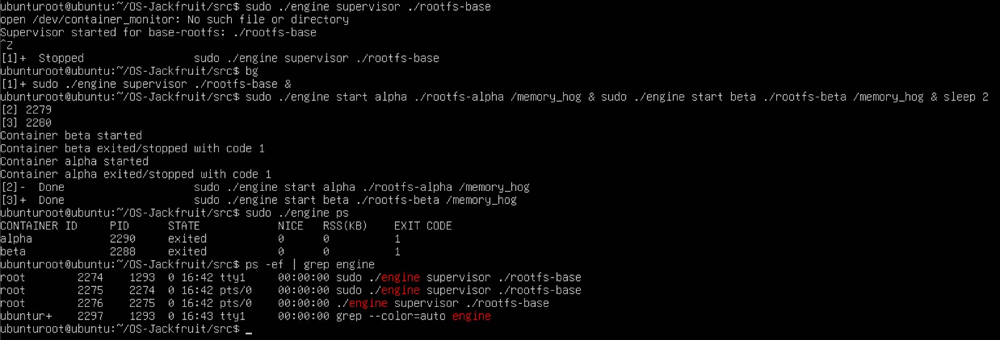
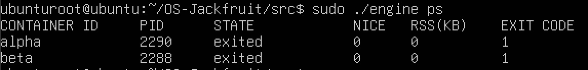

# Documentation

# OS-Jackfruit: Multi-Container Runtime

A lightweight Linux container runtime in C with a long-running supervisor and a kernel-space memory monitor.

## 1. Team Information
- ** Aditi Vignesh - PES1UG24CS023
- ** Piya Banerjee - PES1UG25CS830

## 2. Build, Load Instructions 
```
# Build the Project
make

# Build the Supervisor - engine 
gcc -o engine engine.c -lpthread

# Load the Kernel Module
sudo insmod monitor.ko
# check if module is loaded 
lsmod | grep monitor
# check kernel logs
dsmeg | tail

# Start the supervisor
sudo ./engine supervisor ./rootfs-base

# Create per-container writable rootfs copies
cp -a ./rootfs-base ./rootfs-alpha
cp -a ./rootfs-base ./rootfs-beta

# list Running containers
sudo ./engine ps

# inspect a container
sudo ./engine logs alpha

# CPU Workload
./cpu_hog

# Memory workload
./memory_hog

# I/O Workload
./io_pulse

# Monitoring kernel logs
dmesg | tail -f

# stop all workloads
killall cpu_hog memory_hog io_pulse

# unload kernel module
sudo rmmod monitor
lsmod | grep monitor # verify removal

# clean build files
make clean

# Stop containers
sudo ./engine stop alpha
sudo ./engine stop beta
```
## 3. Demo with Screenshots

### 1. Multi-Container Supervision

Multiple containers (alpha, beta) running under a single supervisor process.

### 2. Metadata Tracking



Supervisor metadata tracking for active containers.

### 3. Bounded-Buffer Logging


### 4. CLI and IPC

### 5. Soft-Limit Warning


### 6. Hard-Limit Enforcement


### 7. Scheduling Experiment


### 8. Clean Teardown


## 4. Engineering Analysis

### 4.1 Isolation Mechanisms
Our runtime achieves process isolation through Linux namespaces created at container spawn time using `clone()` with `CLONE_NEWPID`, `CLONE_NEWUTS`, and `CLONE_NEWNS` flags. 
The PID namespace gives each container its own process numbering where the init process sees itself as PID 1, while the host maintains the real PIDs. 
The UTS namespace provides the container with its own hostname, independent from the host system. 
The mount namespace is critical because it gives each container a private mount table, preventing the container from seeing or modifying host mounts. 
Combined with `chroot`, which remaps the container's root filesystem to its assigned rootfs directory, this creates filesystem isolation. 
What the host kernel still shares with all containers is the system call interface, time, and resource limits because these namespaces were not created. 
We also do not isolate the network or user namespaces, meaning containers share the host's network interfaces and UID mappings.

### 4.2 Supervisor and Process Lifecycle
A long-running parent supervisor is very important because it provides a parent process that exists beyond individual container lifetimes.
Without it, each container would be an orphaned process, and we would lose the ability to track container metadata after they exit.
When we use `clone()` to create container processes, the supervisor keeps the parent-child relationship, allowing proper signal delivery and exit status through `waitpid()`.
This matters for correct reaping to prevent zombie processes and for tracking why each container exited. 
The supervisor also distinguishes between a normal exit, a graceful stop initiated by the `stop` command, and a hard-limit kill by the kernel module, by setting a `stop_requested` flag before sending signals.
This flag is checked during child reap to classify the termination reason in metadata.

### 4.3 IPC, Threads, and Synchronization
Our runtime uses two separate IPC paths.
Path A is the logging pipeline where each container's `stdout` and `stderr` flow through pipes to producer threads, into a bounded buffer, and out to consumer threads that write log files.
The bounded buffer is a circular queue protected by a mutex with two condition variables for signaling when the buffer is not empty or not full, allowing producers to block when the buffer fills rather than dropping data. 
Path B is the control channel using a UNIX domain socket where CLI commands are sent to a supervisor handler thread that processes requests and sends responses over connected sockets.
For metadata access, we use a single mutex protecting the container linked list because metadata operations are infrequent and relatively short-lived, so the contention is low. 
The kernel module uses a mutex for the monitored process list since the timer callback runs only once per second, making the latency overhead of a mutex acceptable compared to a spinlock that would burn CPU cycles while waiting.

### 4.4 Memory Management and Enforcement
Resident Set Size (RSS) measures the number of memory pages currently held in physical RAM. 
It does not measure pages swapped to disk, memory-mapped file contents that are not resident, or cache pages that could be reclaimed. 
The soft and hard limits serve different policies because a soft limit acts as an early warning mechanism that logs a single event when first exceeded, while a hard limit enforces termination to prevent a runaway process from consuming available memory. 
The enforcement mechanism belongs in kernel space rather than user space because only the kernel has direct access to `struct mm_struct` containing accurate RSS information, and user space cannot reliably intercept memory allocations or page faults to enforce limits, and any user-space polling would have inherent race conditions with rapid allocations.

### 4.5 Scheduling Behavior
*To be added*

## 5. Design Decisions and Tradeoffs

### Namespace Isolation
We used:
- CLONE_NEWPID (creates a new PID namespace with child getting PID 1)
- CLONE_NEWUTS (creates a new UTS namespace gives the container its own hostname)
- CLONE_NEWNS (creates a new mount namespace, giving the container its own mount table) 
- chroot (which changes the root filesystem, preventing the container from accessing files outside its rootfs) 
to provide the namespace isolation with the containers. 
The tradeoff made is that this doesn't provide network namespace, user namespace (shares the same UIDs), IPC namespace (allows for shared memory between containers), and device isolation (/dev from host).
We didn't implement network namespace isolation because the container will have to manage the interfaces.

### Supervisor Architecture
The supervisor architecture has a long-running parent process with per-command client spawned.
The supervisor is the parent process for all the containers. This architecture enables shared logging pipeline and metadata tracking across containers, and increases reliability when containers fail.

### IPC/Logging
For IPC and logging, we use a UNIX domain socket for control, and use pipes and a mutex for logging. 
The tradeoff made with the UNIX socket is that we have to cross the userspace-kernel boundary twice when sending and receiving commands. 
This is acceptable here, because sending and recieving commands is an infrequent operation, and using UNIX sockets prevent having to synchronise this operation.

### Kernel Monitor
The kernel monitor is a kernel module with linked list and timer-based polling, where we use a mutex over a spinlock for acccessing the container list.
The tradeoff made here is latency, a mutex would cause there to be another context-switch when the lock is held.
This is acceptable because the critical section is small and the timer only runs once every second, which is minimal.
We also prefer a mutex over spinlock because it reduces the amount of CPU cycles burned waiting for the lock to be released.

## 6. Scheduler Experiment Results

*To be added*


